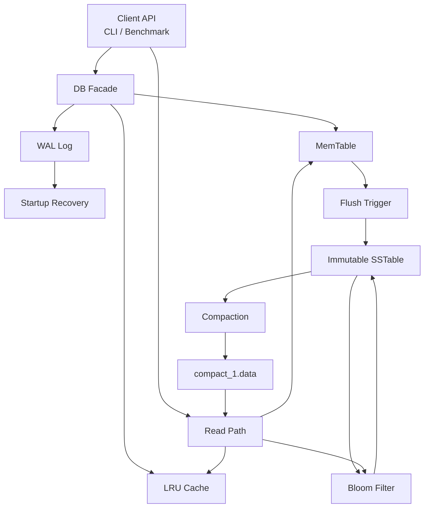

# MiniKV

MiniKV is a compact C++17 key-value storage engine inspired by LSM-Tree architecture. It is designed as an educational systems project for understanding write-ahead logging, in-memory buffering, immutable SSTables, cache-aware reads, Bloom Filter pruning, and basic compaction.

The implementation uses STL containers, CMake, and local file I/O. It is intentionally small and readable, with clear module boundaries for storage-engine experimentation.

## Project Overview

MiniKV exposes a simple command-line key-value interface:

```text
put <key> <value>
get <key>
delete <key>
```

The project uses an LSM-tree-inspired design because it favors write-heavy workloads by converting random updates into sequential disk writes. Writes are buffered in memory, flushed into immutable SSTable files, and later merged through compaction. This keeps the storage model approachable while still reflecting core ideas used in real storage engines.

MiniKV is not a production database. It does not implement concurrency control, snapshots, block indexes, binary table formats, or distributed storage.

## Architecture



## Features

- Write-Ahead Logging with startup recovery
- MemTable backed by `std::unordered_map`
- Sorted text SSTables in `key:value` format
- Tombstone-based deletes using `__DELETE__`
- Automatic MemTable flush
- Basic SSTable compaction into `compact_1.data`
- In-memory Bloom Filter per SSTable
- LRU Cache implemented with `std::list` and `std::unordered_map`
- Runtime configuration through `data/config.txt`
- Standalone benchmark executable with storage and cache statistics

## Storage Flow

### Write Path

Writes are first appended to the WAL for durability and then inserted into the MemTable. The LRU Cache is updated with the latest value. When the MemTable reaches the configured flush threshold, its contents are written into a new immutable SSTable and the WAL is truncated.

### Read Path

Reads check the LRU Cache first, then MemTable, then persisted tables. Before scanning an SSTable file, MiniKV checks that table's Bloom Filter and skips the file when the key is definitely absent. Tombstones are treated as deleted values.

### Flush and Compaction

Flush creates sorted `sst_N.data` files under `data/`. When the number of normal SSTables reaches the configured compaction threshold, MiniKV merges them into `compact_1.data`, keeps the newest value for each key, removes tombstones, and deletes the old SSTable files.

## Components

| Component | Responsibility |
| --- | --- |
| `DB` | Coordinates reads, writes, recovery, flush, compaction, cache, and configuration. |
| `Config` | Loads `flush_threshold`, `cache_size`, and `compaction_threshold` from `data/config.txt`. |
| `WAL` | Appends write records before MemTable mutation and replays them on startup. |
| `MemTable` | Stores active key-value data in memory with tombstone support. |
| `SSTable` | Manages immutable sorted table files, lookup order, Bloom Filters, and compaction. |
| `BloomFilter` | Provides probabilistic SSTable pruning before file scans. |
| `LRUCache` | Caches hot read results with hit/miss accounting. |
| `Benchmark` | Measures write/read throughput and reports storage, cache, and Bloom Filter statistics. |

## Configuration

MiniKV reads configuration from:

```text
data/config.txt
```

Supported keys:

```text
flush_threshold=5
cache_size=100
compaction_threshold=3
```

If `config.txt` is missing, defaults are used:

```text
flush_threshold = 5
cache_size = 100
compaction_threshold = 3
```

Invalid or unknown entries are ignored.

## Build

MiniKV is built with CMake and C++17.

Using CMake presets:

```powershell
cmake --preset x64-debug
cmake --build out/build/x64-debug
```

Visual Studio 2022 can also open the repository as a CMake project. The build defines two executable targets:

- `MiniKV`
- `MiniKVBenchmark`

## Run

From the project root:

```powershell
.\out\build\x64-debug\MiniKV.exe
```

Example commands:

```text
put name huiyu
get name
delete name
```

Runtime data is stored under the project `data/` directory.

## Run Benchmark

```powershell
.\out\build\x64-debug\MiniKVBenchmark.exe
```

The benchmark writes 10,000 keys and then runs 10,000 reads using an 80/20 access pattern:

- 80% of reads target the first 100 hot keys
- 20% of reads target random keys across the full key range

The benchmark is primarily useful for observing storage behavior and instrumentation:

- put/get timing
- flush count
- SSTable count
- cache hit ratio
- Bloom Filter skip count
- Bloom Filter false positive count

Benchmark data is isolated under:

```text
data/benchmark
```

## Benchmark Example

Example output format:

```text
MiniKV Benchmark
Operations: 10000
Put total time: 45.64 s
Get total time: 25.62 s
Write TPS: 219.09
Read TPS: 390.39
Flush count: 2000
SSTable count: 3
Cache hit count: 5616
Cache miss count: 4384
Cache hit ratio: 56.16%
Bloom filter skip count: 8758
Bloom filter false positive count: 7
```

Exact values depend on build type, machine, filesystem state, and configuration.

## Directory Structure

```text
MiniKV/
├── CMakeLists.txt
├── CMakePresets.json
├── README.md
├── data/
│   ├── config.txt          optional runtime configuration
│   ├── wal.log             generated by WAL
│   ├── sst_N.data          generated by flush
│   └── compact_1.data      generated by compaction
├── src/
│   ├── benchmark.cpp
│   ├── bloom_filter.cpp
│   ├── bloom_filter.h
│   ├── config.cpp
│   ├── config.h
│   ├── db.cpp
│   ├── db.h
│   ├── lru_cache.cpp
│   ├── lru_cache.h
│   ├── main.cpp
│   ├── memtable.cpp
│   ├── memtable.h
│   ├── sstable.cpp
│   ├── sstable.h
│   ├── wal.cpp
│   └── wal.h
└── tests/
```

## Future Improvements

- Binary SSTable format with block-level layout
- Multi-level compaction strategy
- Concurrent read/write support
- Persistent Bloom Filter metadata
